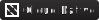
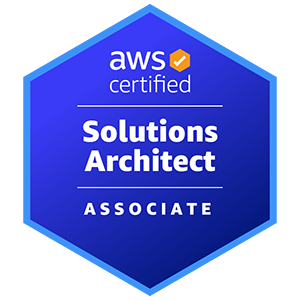
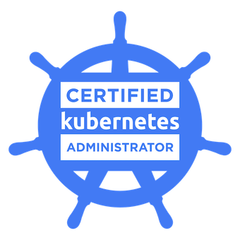
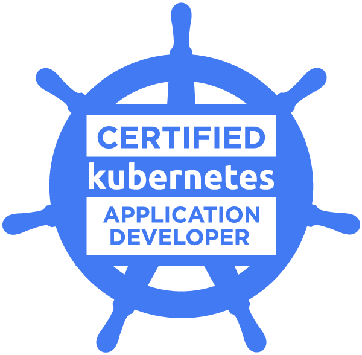

# Cloud · DevOps · AI Certifications
 

 

## 🏆 Earned

<table>
  <tr>
    <td align="center" width="210">
        
       
      
    </td>
    <td align="center" width="210">
        
       
      
    </td>
    <td align="center" width="210">
        
       
      
    </td>
  </tr>
</table>

 

## 🚀 In Progress · 2026

<table>
  <tr>
    <td align="center" width="210">
       
      
    </td>
    <td align="center" width="210">
       
      
    </td>
    <td align="center" width="210">
       
      
    </td>
    <td align="center" width="210">
       
      
    </td>
  </tr>
</table>

 

`Kubernetes`&nbsp;·&nbsp;`AWS`&nbsp;·&nbsp;`Cloud Native`&nbsp;·&nbsp;`DevOps`&nbsp;·&nbsp;`AI`

